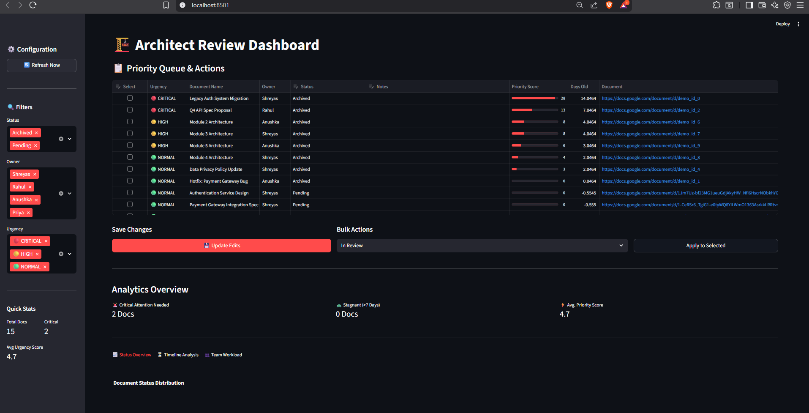
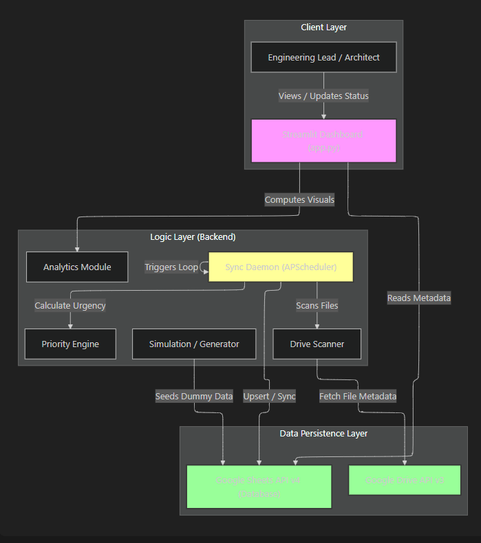

Keystone: Architect Review Dashboard
Zero-friction document review tracking for high-velocity engineering teams.

Keystone is a real-time "Command Center" for Engineering Design Reviews (EDRs). It solves the "Google Doc Purgatory" problem by automatically syncing, scoring, and visualizing technical reviews directly from your Google Drive.

🚨 The Problem
In fast-paced engineering teams, Design Reviews are critical but chaotic:

Lost Links: Review requests get buried in Slack threads or Email.

Zero Visibility: Managers don't know which 20+ documents are "Pending" vs. "Approved."

Stagnation: Critical designs sit unreviewed for weeks because they are out of sight.

Context Switching: Architects hate updating Jira tickets; they just want to work in Google Docs.

💡 The Solution
Keystone provides a zero-friction layer over your existing workflow.

Auto-Discovery: A background daemon watches your Google Drive. No manual entry required.

Priority Engine: Algorithms calculate a "Urgency Score" based on document age and inactivity.

Dual Interface:

Architects: Continue working in Google Docs (no new tool to learn).

Managers: Use the Keystone Dashboard to visualize bottlenecks and SLA breaches.

🏗️ System Architecture
The system operates on a "Hub and Spoke" model with Google Sheets acting as the high-availability database.

🛠️ Tech Stack
Frontend: Streamlit (Python-based UI framework)

Backend: Python 3.10+

Database: Google Sheets (via gspread)

APIs: Google Drive API v3, Google Sheets API v4

Analytics: Plotly Express for interactive visualization

Scheduling: APScheduler for background synchronization

🚀 Key Features
1. The Priority Engine 🧠
Keystone doesn't just list files; it ranks them.

Formula: Priority Score = (Days Since Creation) + (Days Since Last Edit)

Visual Cues:

🔴 CRITICAL (Score > 10): Immediate attention needed.

🟡 HIGH (Score 5-10): Approaching SLA breach.

🟢 NORMAL (Score < 5): On track.

2. Bi-Directional Sync 🔄
Drive -> Dashboard: New files created in Drive appear in the dashboard automatically.

Dashboard -> Sheets: Status changes (e.g., "Approved") made in the UI are written back to the central database instantly.

3. Operational Analytics 📊
Queue Health: Real-time distribution of Pending vs. Completed reviews.

Stagnation Timeline: A scatter plot identifying "stale" reviews (large bubbles = old docs).

Workload Balancing: See which architect is overloaded with pending reviews.

⚙️ Installation & Setup
Prerequisites
Python 3.8 or higher

A Google Cloud Project with Drive & Sheets APIs enabled

1. Clone the Repository
Bash

git clone https://github.com/YOUR_USERNAME/architect-review-dashboard.git
cd architect-review-dashboard
2. Environment Setup
Bash

# Create virtual environment
python -m venv venv

# Activate it
# Windows:
.\venv\Scripts\activate
# Mac/Linux:
source venv/bin/activate

# Install dependencies
pip install -r requirements.txt
3. Configuration
Place your Google Cloud Credentials (credentials.json) in the root folder.

Create a config.json file in the root folder:

JSON

{
    "google": {
        "sheet_id": "YOUR_GOOGLE_SHEET_ID_HERE"
    },
    "sync": {
        "interval_minutes": 15
    }
}
4. Run the System
You need two terminal windows running simultaneously.

Terminal 1: The Backend (Sync Daemon)

Bash

python sync_daemon.py
# Logs will appear showing Drive scan status
Terminal 2: The Frontend (Dashboard)

Bash

streamlit run app.py
# Opens automatically in your browser at localhost:8501
📸 Screenshots
1. The Priority Queue
Auto-sorted list highlighting critical items in red.

2. Analytics Tab
Visual breakdown of team workload and stagnation.

🤝 Contributing
Fork the Project

Create your Feature Branch (git checkout -b feature/AmazingFeature)

Commit your Changes (git commit -m 'Add some AmazingFeature')

Push to the Branch (git push origin feature/AmazingFeature)

Open a Pull Request

Built to track my Capstone teams progress in December, 2025 by Shreyas Patro 
